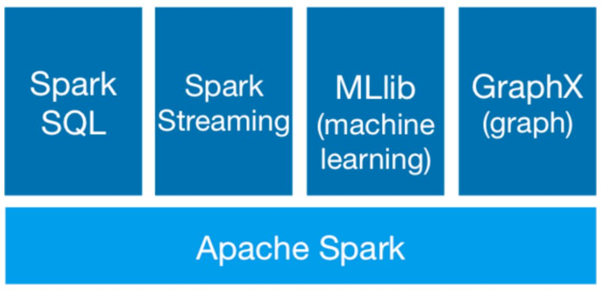
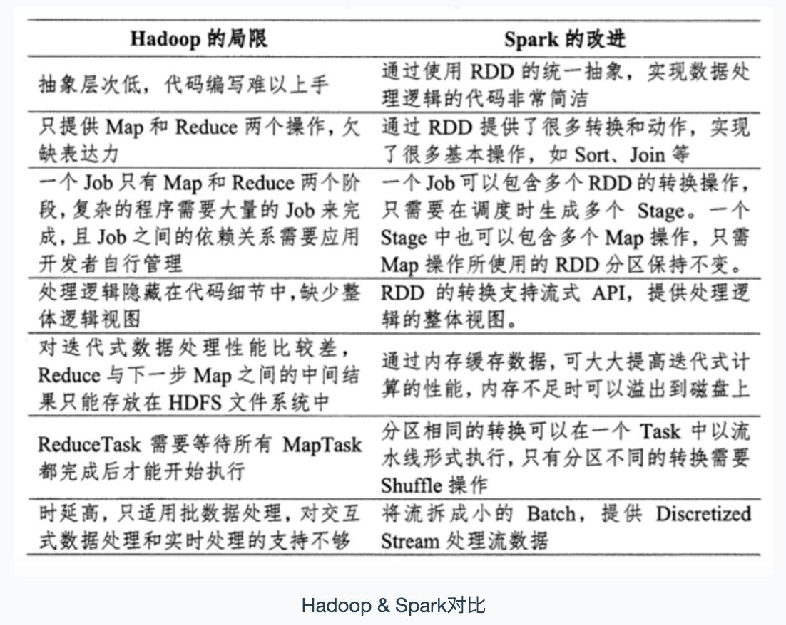
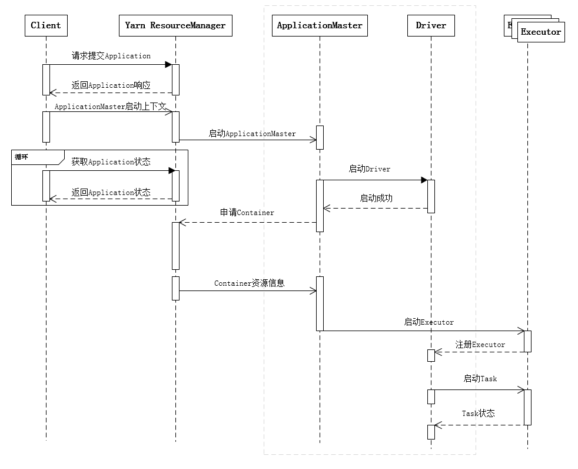
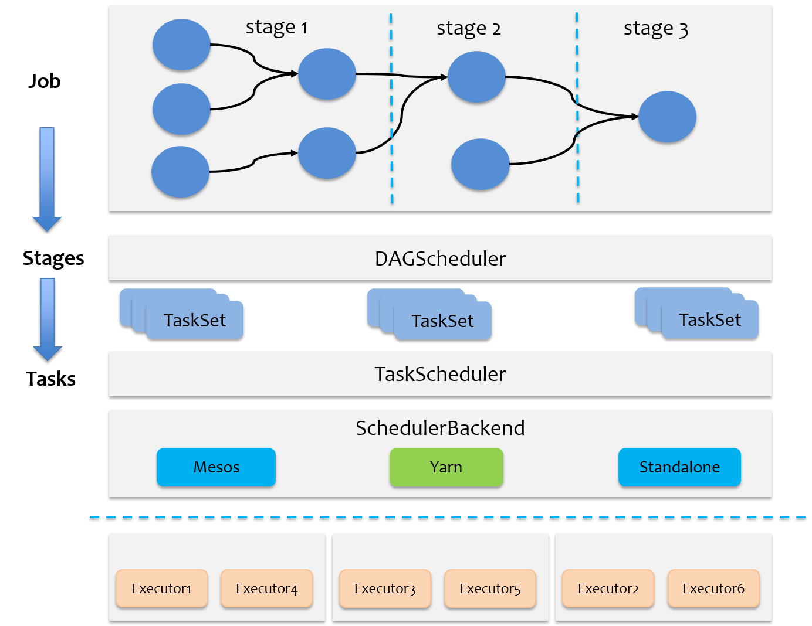
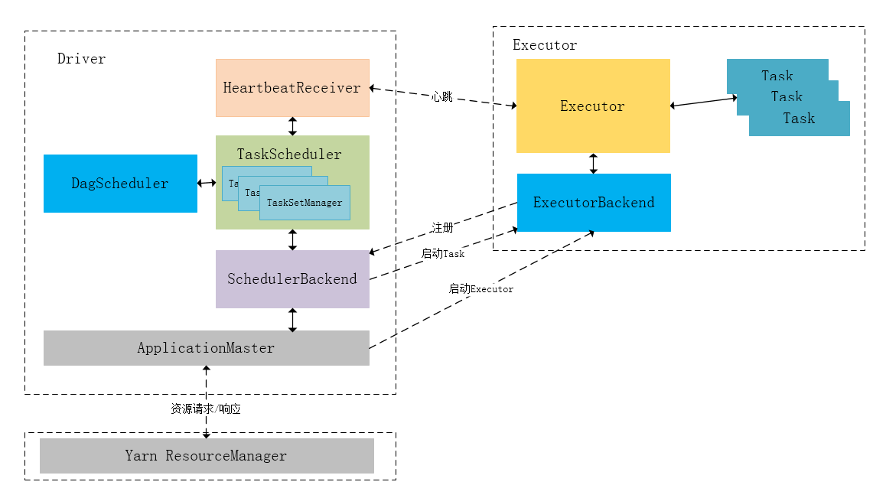
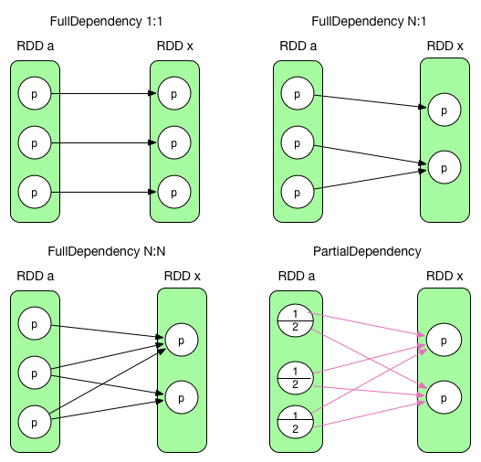
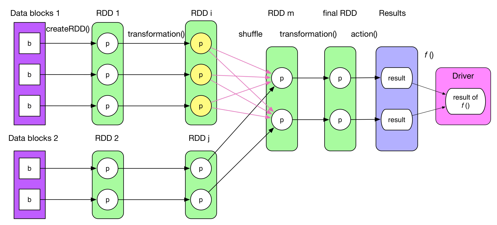

# Spark基本原理

[TOC]

## 1 spark简介

​		spark是UC Berkeley AMP Lab（加州大学伯克利分校AMP实验室）所开源的类Hadoop MapReduce通用并行框架，专门用于大数据的迭代计算。spark的整个生态目前包括了四个计算框架，如图所示：

* **spark** **SQL**：提供了非常丰富的类SQL的查询，RDD/DataFrame
* **spark streaming**：流式计算，主要用于处理线上实时时序数据
* **spark mlib**：提供大量常用的机器学习模型和调优
* **spark graphx**：提供基于图结构的算法 

​		与Hadoop只能使用map和reduce实现复杂的job不同，spark提供了丰富的RDD接口，以便实现不同的大数据操作，实现逻辑较为清晰。同时，Hadoop在一次MapReduce运算后需要将中间结果存入到磁盘中，下一次MR计算再从磁盘中取出中间结果，这样就会带来多余的IO消耗，而spark是将数据一直缓存在内存中，直到计算得到最后的结果，再将结果数据写入磁盘中，在多次运算的情况下，spark的运算速度大于MR。

​		具体区别：

## 2 spark运行机制

一些常见的专业术语:

- application：应用程序，由用户创建的spark程序，如WordCount.scala；

- driver：驱动，运行Application的main函数和创建SparkContext的进程。

整个集群分为master节点和work节点：

- master：master节点常驻Master守护进程和Driver守护进程，负责管理全部的worker节点，将串行任务转换成可并行执行的任务集tasks，同时负责出错问题处理；

- worker：worker节点常驻Worker守护进程，负责与Master节点通信并管理executors执行任务；

- executor：执行单元，为Application运行在Worker节点上的一个进程，该进程负责运行Task，并且负责将数据存在内存或者磁盘上，每个Application都有各自独立的Executors；

- Operation：作用于RDD的各种操作分为Transformation和Action；

- Cluster Manager： 在集群上获取资源的外部服务(例如：Local、Standalone、Mesos或Yarn等集群管理系统)。

spark根据application中的action operation会创建不同的jobs，每一个jobs又会根据shuffle划分成不同的stages，每个stage执行一部分代码片段，并创建一批task，分发到各个executor上去执行。每一个Worker节点上存在一个或多个Executor进程，该对象拥有一个线性池，每个线程负责一个Task任务的执行。根据 Executor 上 CPU-core 的数量，其每个时间可以并行多个跟 core 一样数量的 Task。**Task 任务即为具体执行的 Spark 程序的任务.**

		* 用户通过spark-submit提交application后，通过client向ResourceManager请求启动一个Application，同时检查是否有足够的资源满足Application的需求，如果满足，准备ApplicationMaster启动的上下文，交给ResourceManager，并循环监控Application状态。
		* 当提交的队列资源充分时，ResourceManager会启动ApplicationMaster，ApplicationMaster会单独启动Driver后台进程，Driver进程用于运行Application的main()函数，启动成功后，ApplicationMaster收到连接并开始向ResourceManager申请containers资源，当ResourceManager收到申请后会返回Container资源，并在对应的Container上启动Executor执行单元，执行单元启动成功后由Driver往Executor分发相应的task。

​		可以看出，Driver并不直接和Yarn通信，而是通过ApplicationMaster把资源申请的逻辑抽象出来，这样可以适配不同的资源管理系统。Driver进程主要包括完成两项任务：一方面与ApplicationMaster保持通信，通过ApplicationMaster向ResourceManager申请资源，另一方面负责所有Executor的调度以根据业务逻辑完成整个任务。当ResourceManager向ApplicationMaster返回Container资源后，ApplicationMaster会立即在对应的Container上启动Executor进程，Executor进程启动会会注册给Driver，注册成功后会保持与Driver的心跳，同时等到Driver分发任务，当分发的任务执行完毕后，将任务状态上报给Driver。

		### 2.1 任务调度

​		当Executor向Driver注册成功后，Driver会根据用户的代码逻辑进行任务的准备和分发。这一过程涉及到了job、stage和task三个概念：

* job：以action操作为边界，遇到一个action触发一个job；

* stage：job的子集，以RDD宽依赖（即shuffle）为边界划分stage；

* task：stage的子集，以并行度（分区数）为区分，分区数为所多少，则有多少个task并行。

  ​	spark的任务调度主要包括stage级的调度和task级的调度，总体调度流程如图：

  

  

Spark RDD通过其Transaction操作，形成RDD血缘关系图，即DAG，最后通过action的调用，触发job并调度执行。DAGSchedular负责Stage级的调度，主要是将DAG划分成若干Stages，并将每个Stage打包成TaskSet交给TaskSchedular调度；TaskSchedular负责Task级的调度，将TaskSet按照指定的调度策略分发搭配Executors上执行，调度过程中由SchedulerBackend负责提供可用资源。下面这张图描述了Spark-On-Yarn模式下在任务调度期间，ApplicationMaster、Driver以及Executor内部模块的交互过程。

> Driver初始化SparkContext过程中，会分别初始化DAGSchedular、TaskSchedular、SchedulerBackend和HeartbeatReceiver，并启动SchedulerBackend以及HeartbeatReceiver。SchedulerBackend通过ApplicationMaster申请资源，并不断从TaskScheduler中拿到合适的Task分发到Executor执行。HeartbeatReceiver负责接收Executor的心跳信息，监控Executor的存活状况，并通知到TaskScheduler。

### 2.2 Job逻辑执行图

​		首先了解一下RDD之间的依赖关系，常见的依赖关系主要有以下几种：

​		前三种是完全依赖，RDD x中的每一个partition都与parent RDD中的partition/partitions相关，最后一个是部分依赖，即RDD x的partition只与parent RDD中的partition中的一部分数据相关。完全依赖也称窄依赖NarrowDependency，部分依赖也称宽依赖WideDependency/ShuffleDependency。

​		Spark RDD根据RDD之间的依赖关系生成DAG血缘关系图，DAGScheduler会根据DAG之间的依赖关系生成Job逻辑执行图。典型的Job逻辑执行图如图所示：

1. 从数据源读取数据创建最初的RDD，ParallelCollectionRDD；
2. 对RDD进行一系列的transform操作，每一个 transformation() 会产生一个或多个包含不同类型 T 的 RDD[T]。T 可以是 Scala 里面的基本类型或数据结构，不限于 (K, V)。但如果是 (K, V)，K 不能是 Array 等复杂类型（因为难以在复杂类型上定义 partition 函数）。
3. 对最后的 final RDD 进行 action() 操作，每个 partition 计算后产生结果 result。
4. 将 result 回送到 driver 端，进行最后的 f(list[result]) 计算。

### 2.3 Job物理执行图

## 3 spark性能优化

### shuffle操作

### checkpoint

### cache

参考链接：[Spark Scheduler内部原理剖析](http://sharkdtu.com/posts/spark-scheduler.html)

​					[Spark Internals](https://github.com/JerryLead/SparkInternals/tree/master/markdown)

