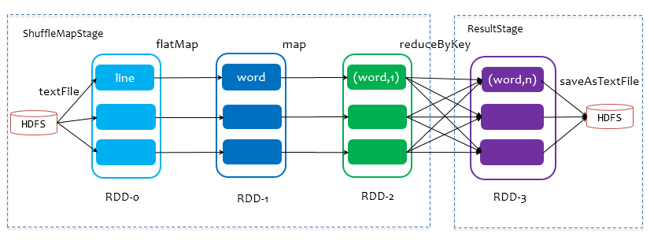
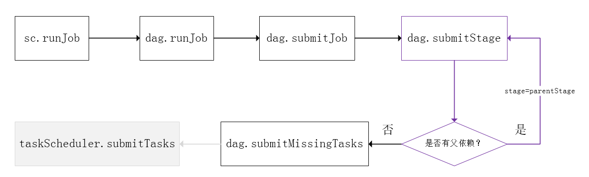

# Spark基本原理

[TOC]

## 1 spark简介

​		spark是UC Berkeley AMP Lab（加州大学伯克利分校AMP实验室）所开源的类Hadoop MapReduce通用并行框架，专门用于大数据的迭代计算。spark的整个生态目前包括了四个计算框架，如图所示：

* **spark** **SQL**：提供了非常丰富的类SQL的查询，RDD/DataFrame
* **spark streaming**：流式计算，主要用于处理线上实时时序数据
* **spark mlib**：提供大量常用的机器学习模型和调优
* **spark graphx**：提供基于图结构的算法 

​		与Hadoop只能使用map和reduce实现复杂的job不同，spark提供了丰富的RDD接口，以便实现不同的大数据操作，实现逻辑较为清晰。同时，Hadoop在一次MapReduce运算后需要将中间结果存入到磁盘中，下一次MR计算再从磁盘中取出中间结果，这样就会带来多余的IO消耗，而spark是将数据一直缓存在内存中，直到计算得到最后的结果，再将结果数据写入磁盘中，在多次运算的情况下，spark的运算速度大于MR。

​		具体区别：

## 2 spark运行机制

一些常见的专业术语:

- application：应用程序，由用户创建的spark程序，如WordCount.scala；

- driver：驱动，运行Application的main函数和创建SparkContext的进程。

整个集群分为master节点和work节点：

- master：master节点常驻Master守护进程和Driver守护进程，负责管理全部的worker节点，将串行任务转换成可并行执行的任务集tasks，同时负责出错问题处理；

- worker：worker节点常驻Worker守护进程，负责与Master节点通信并管理executors执行任务；

- executor：执行单元，为Application运行在Worker节点上的一个进程，该进程负责运行Task，并且负责将数据存在内存或者磁盘上，每个Application都有各自独立的Executors；

- Operation：作用于RDD的各种操作分为Transformation和Action；

- Cluster Manager： 在集群上获取资源的外部服务(例如：Local、Standalone、Mesos或Yarn等集群管理系统)。

spark根据application中的action operation会创建不同的jobs，每一个jobs又会根据shuffle划分成不同的stages，每个stage执行一部分代码片段，并创建一批task，分发到各个executor上去执行。每一个Worker节点上存在一个或多个Executor进程，该对象拥有一个线性池，每个线程负责一个Task任务的执行。根据 Executor 上 CPU-core 的数量，其每个时间可以并行多个跟 core 一样数量的 Task。**Task 任务即为具体执行的 Spark 程序的任务.**

		* 用户通过spark-submit提交application后，通过client向ResourceManager**请求启动一个Application**，同时检查是否有足够的资源满足Application的需求，如果满足，**准备ApplicationMaster启动的上下文**，交给ResourceManager，并循环监控Application状态。
		* 当提交的队列资源充分时，ResourceManager**会启动ApplicationMaster**，ApplicationMaster会单独**启动Driver后台进程**，Driver进程用于运行Application的main()函数，启动成功后，ApplicationMaster收到连接并开始向ResourceManager申请containers资源，当ResourceManager收到申请后会返回Container资源，并在对应的Container上启动Executor执行单元，执行单元启动成功后由Driver往Executor分发相应的task。

​		可以看出，Driver并不直接和Yarn通信，而是通过ApplicationMaster把资源申请的逻辑抽象出来，这样可以适配不同的资源管理系统。Driver进程主要包括完成两项任务：一方面与ApplicationMaster保持通信，通过ApplicationMaster向ResourceManager申请资源，另一方面负责所有Executor的调度以根据业务逻辑完成整个任务。当ResourceManager向ApplicationMaster返回Container资源后，ApplicationMaster会立即在对应的Container上启动Executor进程，Executor进程启动会会注册给Driver，注册成功后会保持与Driver的心跳，同时等到Driver分发任务，当分发的任务执行完毕后，将任务状态上报给Driver。

		### 2.1 任务调度

​		当Executor向Driver注册成功后，Driver会根据用户的代码逻辑进行任务的准备和分发。这一过程涉及到了job、stage和task三个概念：

* job：以action操作为边界，遇到一个action触发一个job；

* stage：job的子集，以RDD宽依赖（即shuffle）为边界划分stage；

* task：stage的子集，以并行度（分区数）为区分，分区数为所多少，则有多少个task并行。

  ​	spark的任务调度主要包括stage级的调度和task级的调度，总体调度流程如图：

  

  

Spark RDD通过其Transaction操作，形成RDD血缘关系图，即DAG，最后通过action的调用，触发job并调度执行。DAGScheduler负责Stage级的调度，主要是将DAG划分成若干Stages，并将每个Stage打包成TaskSet交给TaskSchedular调度；TaskScheduler负责Task级的调度，将TaskSet按照指定的调度策略分发搭配Executors上执行，调度过程中由SchedulerBackend负责提供可用资源。下面这张图描述了Spark-On-Yarn模式下在任务调度期间，ApplicationMaster、Driver以及Executor内部模块的交互过程。

> Driver初始化SparkContext过程中，会分别初始化DAGSchedular、TaskSchedular、SchedulerBackend和HeartbeatReceiver，并启动SchedulerBackend以及HeartbeatReceiver。SchedulerBackend通过ApplicationMaster申请资源，并不断从TaskScheduler中拿到合适的Task分发到Executor执行。HeartbeatReceiver负责接收Executor的心跳信息，监控Executor的存活状况，并通知到TaskScheduler。

### 2.2 Job逻辑执行图

​		首先了解一下RDD之间的依赖关系，常见的依赖关系主要有以下几种：

​		前三种是完全依赖，RDD x中的每一个partition都与parent RDD中的partition/partitions相关，最后一个是部分依赖，即RDD x的partition只与parent RDD中的partition中的一部分数据相关。完全依赖也称窄依赖NarrowDependency，部分依赖也称宽依赖WideDependency/ShuffleDependency。

​		Spark RDD根据RDD之间的依赖关系生成DAG血缘关系图，DAGScheduler会根据DAG之间的依赖关系生成Job逻辑执行图。典型的Job逻辑执行图如图所示：

1. 从数据源读取数据创建最初的RDD，ParallelCollectionRDD；
2. 对RDD进行一系列的transform操作，每一个 transformation() 会产生一个或多个包含不同类型 T 的 RDD[T]。T 可以是 Scala 里面的基本类型或数据结构，不限于 (K, V)。但如果是 (K, V)，K 不能是 Array 等复杂类型（因为难以在复杂类型上定义 partition 函数）。
3. 对最后的 final RDD 进行 action() 操作，每个 partition 计算后产生结果 result。
4. 将 result 回送到 driver 端，进行最后的 f(list[result]) 计算。

### 2.3 Job物理执行图

​		Job的物理执行图是在stage和task层面上来说的，spark对于一个job进行stage划分的准则是：**从后往前回溯推算，遇到 ShuffleDependency 就断开，遇到 NarrowDependency 就将其加入该 stage。每个 stage 里面 task 的数目由该 stage 最后一个 RDD 中的 partition 个数决定。** **如果 stage 最后要产生 result，那么该 stage 里面的 task 都是 ResultTask，否则都是 ShuffleMapTask。** 之所以称为 ShuffleMapTask 是因为其计算结果需要 shuffle 到下一个 stage，本质上相当于 MapReduce 中的 mapper。ResultTask 相当于 MapReduce 中的 reducer（如果需要从 parent stage 那里 shuffle 数据，也相当于普通 mapper（如果该 stage 没有 parent stage。**Job的计算是以pipline形式计算的，数据只有在需要时才会被计算。**

​		下图是WordCount的物理执行图，整个application包含一个job，由saveAsTextFile触发，这个Job由RDD 3和action操作构成，Spark从RDD 3开始回溯搜索，直至没有parent RDD的RDD 0。在回溯的过程中，RDD 3依赖于RDD 2，并且是ShufflDependency的关系，因此在RDD 3和RDD 2之间进行stage的划分，RDD 3被划分到ResultStage，RDD 2继续往前回溯，均为窄依赖，因此RDD 1 和RDD 0直接被加入搭配ShuffleStage中，实际执行的时候，数据记录会一气呵成地执行RDD-0到RDD-2的转化。

### 2.4 Job的提交流程

1. **rdd.action()** 会调用 `DAGScheduler.runJob(rdd, processPartition, resultHandler)` 来生成 job。
2. **runJob()** 会首先通过`rdd.getPartitions()`来得到 finalRDD 中应该存在的 partition 的个数和类型：Array[Partition]。然后根据 partition 个数 new 出来将来要持有 result 的数组 `Array[Result](partitions.size)`。
3. 最后调用 DAGScheduler 的`runJob(rdd, cleanedFunc, partitions, allowLocal, resultHandler)`来提交 job。cleanedFunc 是 processParittion 经过闭包清理后的结果，这样可以被序列化后传递给不同节点的 task。
4. DAGScheduler 的 **runJob** 继续调用`submitJob(rdd, func, partitions, allowLocal, resultHandler)` 来提交 job。
5. **submitJob()** 首先得到一个 jobId，然后再次包装 func，向 DAGSchedulerEventProcessActor 发送 JobSubmitted 信息，该 actor 收到信息后进一步调用`dagScheduler.handleJobSubmitted()`来处理提交的 job。之所以这么麻烦，是为了符合事件驱动模型。
6. handleJobSubmmitted() 首先调用 finalStage = newStage() 来划分 stage，然后**submitStage**(finalStage)。由于 finalStage 可能有 parent stages，实际先提交 parent stages，等到他们执行完，finalStage 需要再次提交执行。再次提交由 handleJobSubmmitted() 最后的 **submitWaitingStages**() 负责。
7. 先确定该 stage 的 missingParentStages，使用`getMissingParentStages(stage)`。如果 parentStages 都可能已经执行过了，那么就为空了。
8. 如果 missingParentStages 不为空，那么先递归提交 missing 的 parent stages，并将自己加入到 waitingStages 里面，等到 parent stages 执行结束后，会触发提交 waitingStages 里面的 stage。
9. 如果 missingParentStages 为空，说明该 stage 可以立即执行，那么就调用**submitMissingTasks**(stage, jobId)来生成和提交具体的 task。如果 stage 是 ShuffleMapStage，那么 new 出来与该 stage 最后一个 RDD 的 partition 数相同的 ShuffleMapTasks。如果 stage 是 ResultStage，那么 new 出来与 stage 最后一个 RDD 的 partition 个数相同的 ResultTasks。一个 stage 里面的 task 组成一个 TaskSet，最后调用taskScheduler.**submitTasks**(taskSet)来提交一整个 taskSet。

## 3 spark性能优化

### shuffle操作

### checkpoint

### cache

参考链接：[Spark Scheduler内部原理剖析](http://sharkdtu.com/posts/spark-scheduler.html)

​					[Spark Internals](https://github.com/JerryLead/SparkInternals/tree/master/markdown)

