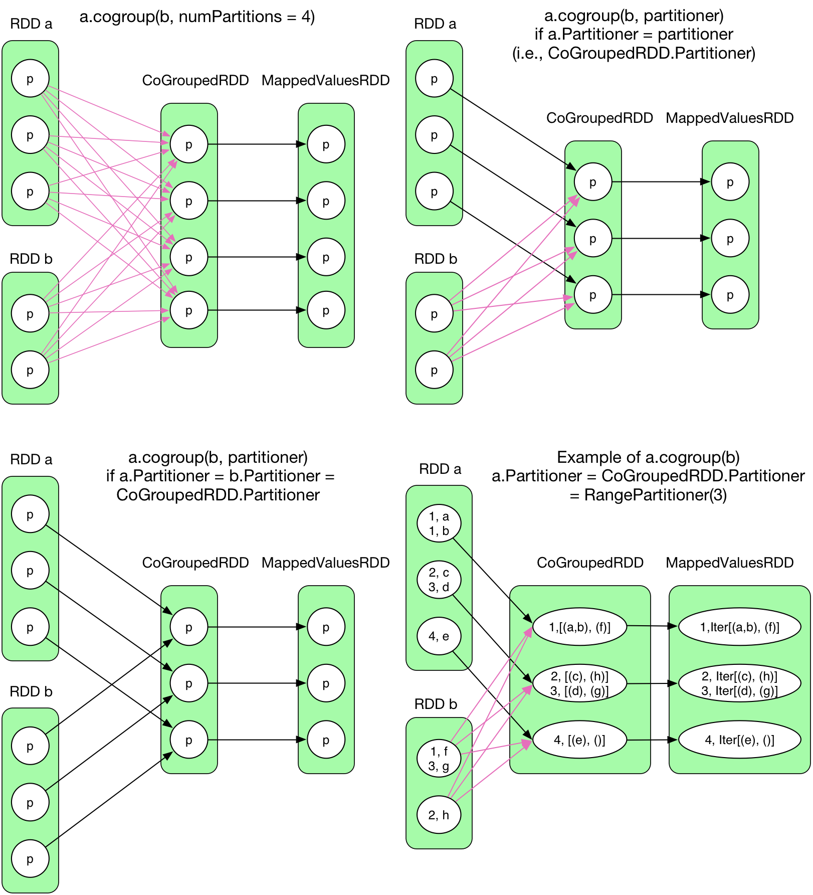
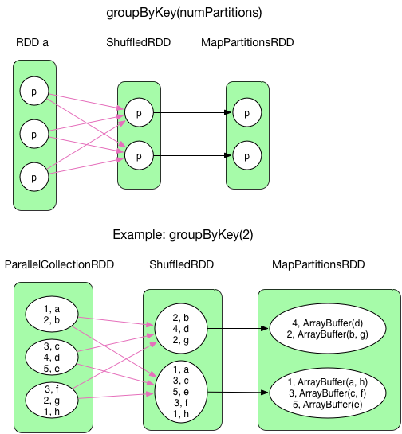
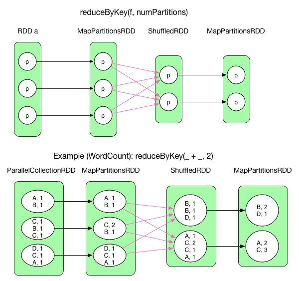
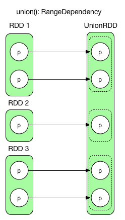
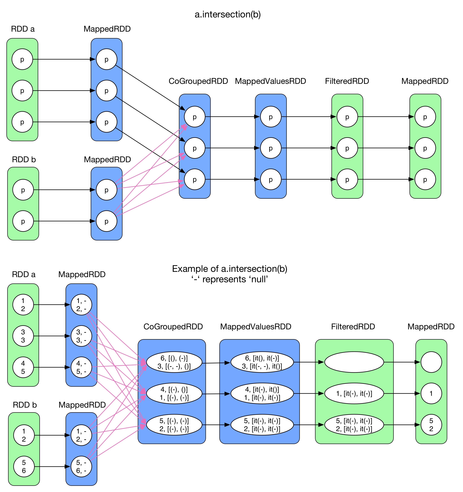
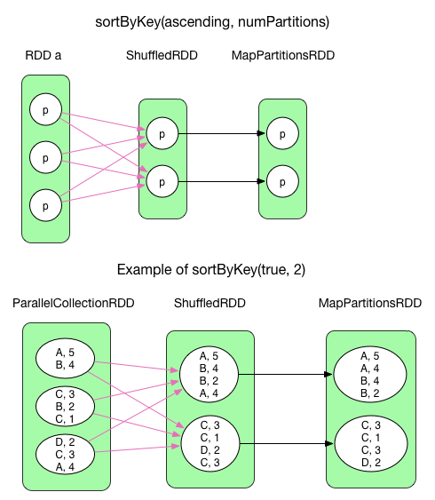
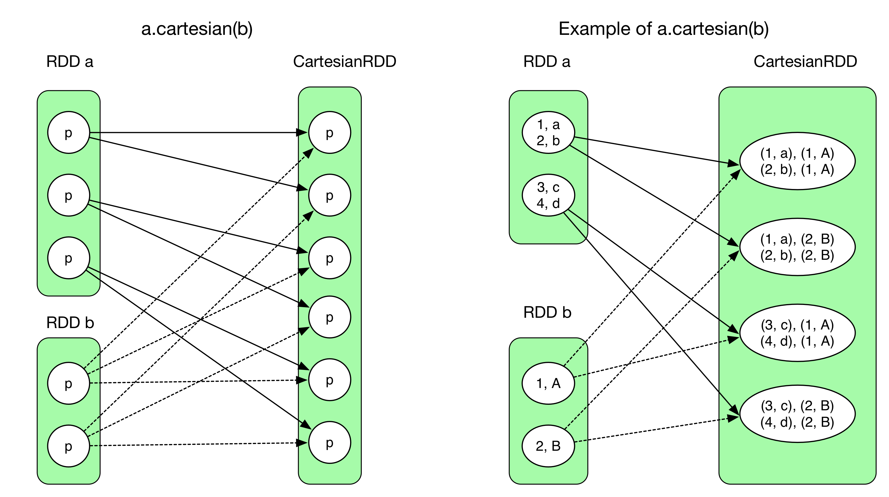
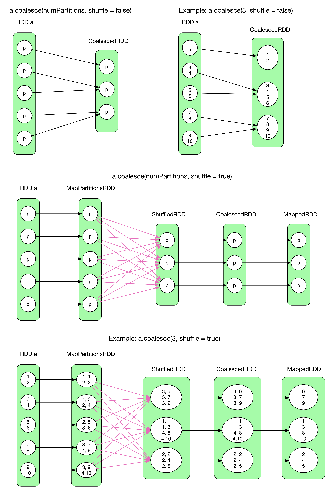

# spark 核心RDD操作学习

[TOC]
##RDD概念

RDD(Resilient Distributed Datasets)，全称弹性式分布数据集，一种分布式的内存抽象，以只读的形式存储在不同的分区中。RDD是只读的，要想生成一个RDD，只能由一个RDD生成或者从文件系统中读取。为此，RDD支持非常丰富的转换操作，如map,join,union等。RDD之间是有依赖关系的，新生成的RDD会记录生成来源，从而形成一张包含依赖关系的有向无环图，即DAG图，该DAG图会包含RDDs间的依赖关系，即血缘关系，每一张DAG图会以action操作结束，即对RDD进行计算，得到相应的结果。可以看出，RDD的操作主要包括两大类，Transform操作和Action操作。Transform操作不会对RDD进行计算，只会记录RDD之间的依赖关系，Action操作会立即触发计算，将从DAG图的源头开始对整个DAG图进行计算。
常用的transform操作和action操作如下表所示：

## 1⃣️transform操作
```scala
  val rdd = sc.makeRDD(Seq(("数学", 95), ("语文", 84), ("英语", 95), ("数学", 90), ("语文", 90)))
```

### 1. map
源码：

```scala
def map[U](f: (T) ⇒ U)(implicit arg0: ClassTag[U]): RDD[U]
Return a new RDD by applying a function to all elements of this RDD.
```
例：

```scala
val rddMap = rdd.map(row => (row._1, 1))
println("[map]: " + rddMap.collect.mkString(","))

res: [map]: (数学,1),(语文,1),(英语,1),(数学,1),(语文,1)
```
### 2. filter

源码：

```scala
def filter(f: (T) ⇒ Boolean): RDD[T]

Return a new RDD containing only the elements that satisfy a predicate.
```
例：

```scala
val rddFilter = rdd.filter(row => row._1.equals("数学"))
println("[filter]: " + rddFilter.collect.mkString(","))

res: [filter]: (数学,95),(数学,90)

```

### 3. distinct

对RDD进行去重操作。由于重复数据可能分散在不同的partition里面，因此需要进行shuffle操作，但是shuffle操作需要的是(K, V)类型的数据，因此对于非只有Key的数据，会先用map方法进行转换，K -> (K, Null)，然后利用reduceByKey算子，进行shuffle，首先在map端进行combine去重，然后reduce生成shuffleRDD，再使用mapRepartition()操作进一步去重，生成mapRepartitionRDD，最后只保留key，转换成MappedRDD。


### 4. flatMap

map(func)函数会对每一条输入进行指定的func操作，然后为每一条输入返回一个对象；而flatMap(func)也会对每一条输入进行执行的func操作，然后每一条输入返回一个相对，但是最后会将所有的对象再合成为一个对象；从返回的结果的数量上来讲，map返回的数据对象的个数和原来的输入数据是相同的，而flatMap返回的个数则是不同的。flatMap相比map多了一个flatten操作。

源码：

```scala
def flatMap[U](f: (T) ⇒ TraversableOnce[U])(implicit arg0: ClassTag[U]): RDD[U]
Return a new RDD by first applying a function to all elements of this RDD, and then flattening the results.
```
例：

```scala
scala> var mapResult = textFile.map(line => line.split("\\s+"))
mapResult: org.apache.spark.rdd.RDD[Array[String]] = MapPartitionsRDD[2] at map at <console>:29

scala> mapResult.collect
res0: Array[Array[String]] = Array(Array(word, in, text), Array(hello, spark), Array(the, third, line))

scala> var flatMapResult = textFile.flatMap(line => line.split("\\s+"))
flatMapResult: org.apache.spark.rdd.RDD[String] = MapPartitionsRDD[3] at flatMap at <console>:29

scala> flatMapResult.collect
res1: Array[String] = Array(word, in, text, hello, spark, the, third, line)
```

使用例子：
uids字段是一个array，用faltMap可以取出array of array，然后展平成一列，值得注意的是，此时如果某一行uids包含null值的话，flatMap不会过去掉null值，此时可用expode函数代替ß

```scala
val uid = output.select("uids").flatMap(row => row.getAs[Seq[String]](0))
```

### 5. sample

源码：

```scala
def sample(withReplacement: Boolean, fraction: Double, seed: Long = Utils.random.nextLong): RDD[T]

Return a sampled subset of this RDD.

withReplacement : can elements be sampled multiple times (replaced when sampled out)

fraction : expected size of the sample as a fraction of this RDD's size without replacement: probability that each element is chosen; fraction must be [0, 1] with replacement: expected number of times each element is chosen; fraction must be greater than or equal to 0

seed: seed for the random number generator

Note
This is NOT guaranteed to provide exactly the fraction of the count of the given RDD.
```
### 6. groupBy
groupBy算子接收一个函数，这个函数返回值作为key，然后通过对这个key对RDD的元素进行分组，分组的元素保存在一个迭代器里

源码：

```scala
def groupBy[K: ClassTag](f: T => K): RDD[(K, Iterable[T])]
def groupBy[K: ClassTag](f: T => K, numPartitions: Int): RDD[(K, Iterable[T])]
def groupBy[K: ClassTag](f: T => K, p: Partitioner): RDD[(K, Iterable[T])]
```
例子：

```scala
val rddGroupByKey = rdd.groupBy(r => r._1)
println("[groupBy]: " + rddGroupByKey.collect.mkString(","))

res: [groupBy]: (语文,CompactBuffer((语文,84), (语文,90))),(英语,CompactBuffer((英语,95))),(数学,CompactBuffer((数学,95), (数学,90)))

val rdd2 = sc.parallelize(List(4,24,5,6,2,1), 1)
val rdd2Group = rdd2.groupBy(r => {if (r % 2 == 0) "even" else "odd"})
println("[groupBy]: " + rdd2Group.collect.mkString(","))

res: [groupBy]: (even,CompactBuffer(4, 24, 6, 2)),(odd,CompactBuffer(5, 1))
```

### 7. cogroup
cogroup是一个pairRDD算子，cogroup可以与两个或多个pairRDD共同进行group，pairRDD指的是包含每一行元素都是键值对(key, value)的RDD。

RDD a和RDD b经过shuffle算子生成CoGroupedRDD，CoGroupedRDD的partitions可以由用户直接设定，与RDD a和RDD b无关。当且仅当CoGroupedRDD的partitions和partitioner类别（默认为HashPartitioner）均相同时，才会与parent RDDs构成1:1的依赖关系，不进行shuffle操作，否则只能是ShuffleDependency。



源码：

```scala
  def cogroup[W](other: RDD[(K, W)]): RDD[(K, (Iterable[V], Iterable[W]))] = self.withScope {
    cogroup(other, defaultPartitioner(self, other))
  }
   def cogroup[W1, W2](other1: RDD[(K, W1)], other2: RDD[(K, W2)])
      : RDD[(K, (Iterable[V], Iterable[W1], Iterable[W2]))] = self.withScope {
    cogroup(other1, other2, defaultPartitioner(self, other1, other2))
  }
   def cogroup[W1, W2, W3](other1: RDD[(K, W1)], other2: RDD[(K, W2)], other3: RDD[(K, W3)])
      : RDD[(K, (Iterable[V], Iterable[W1], Iterable[W2], Iterable[W3]))] = self.withScope {
    cogroup(other1, other2, other3, defaultPartitioner(self, other1, other2, other3))
  }
```

例子：

```scala
val rdd3 = sc.makeRDD(Seq(("数学", 65), ("语文", 43), ("地理", 45)))
val rddCogroup = rdd.cogroup(rdd3)
println("[cogroup]: " + rddCogroup.collect.mkString(","))

res: [cogroup]: (语文,(CompactBuffer(84, 90),CompactBuffer(43))),(英语,(CompactBuffer(95),CompactBuffer())),(地理,(CompactBuffer(),CompactBuffer(45))),(数学,(CompactBuffer(95, 90),CompactBuffer(65)))
```
可以看出，如果某一个RDD的key在另一个RDD中没有找到的话，在cogroup的结果里面将产生一个null的迭代器

### 8. groupByKey
这个算子实际上就是把rdd按照key把相同的records进行聚合，一次shuffle操作即可完成。ShuffleRDD的compute()负责将属于每个partition的数据fetch过来，之后使用后mapPartitions()操作进行聚合，生成mapPartitionsRDD。注意，当groupByKey的过程中某个key的值比较多时，可能会产生**outofMemory**错误
源码：

```scala
def groupByKey(): RDD[(K, Iterable[V])]
def groupByKey(numPartitions: Int): RDD[(K, Iterable[V])]
def groupByKey(partitioner: Partitioner): RDD[(K, Iterable[V])]
```
Group the values for each key in the RDD into a single sequence. Hash-partitions the resulting RDD with the existing partitioner/parallelism level. The ordering of elements within each group is not guaranteed, and may even differ each time the resulting RDD is evaluated.

Note:
**This operation may be very expensive. If you are grouping in order to perform an aggregation (such as a sum or average) over each key, using PairRDDFunctions.aggregateByKey or PairRDDFunctions.reduceByKey will provide much better performance.**



例子：

```scala
val rddGroupByKey = rdd.groupByKey()
println("[rddGroupByKey]: " + rddGroupByKey.collect.mkString(","))

res: [rddGroupByKey]: (语文,CompactBuffer(84, 90)),(英语,CompactBuffer(95)),(数学,CompactBuffer(95, 90))
```

### 9. reduceByKey
​		reduceByKey()相当于传统的MapReduce，整个数据流也与Hadoop中的数据流基本一样。首先对输入的RDD进行mapPartitions()操作，类似于MapReduce中的combiner操作，生成mapPartitionsRDD，然后根据key进行shuffle，生成ShuffleRDD，最后再利用aggregate + mapPartitions转换成mapPartitionsRDD，类似于MapReduce上的reduce。利用reduceByKey这一算子可以对RDD进行各种聚合计算，如sum



源码：

```scala
def reduceByKey(func: (V, V) ⇒ V): RDD[(K, V)]
def reduceByKey(func: (V, V) ⇒ V, numPartitions: Int): RDD[(K, V)]
def reduceByKey(partitioner: Partitioner, func: (V, V) ⇒ V): RDD[(K, V)]
```

例子：

```scala
val rddReduceByKey = rdd.reduceByKey(_ + _)
println("[rddReduceByKey]: " + rddReduceByKey.collect.mkString(","))

res: [rddReduceByKey]: (语文,174),(英语,95),(数学,185)

val rddReduceByKey1 = rdd.reduceByKey((a, b) => a + b)
println("[rddReduceByKey1]: " + rddReduceByKey1.collect.mkString(","))

res: [rddReduceByKey1]: (语文,174),(英语,95),(数学,185)

```
**利用reduceByKey计算平均值**：

```scala
val rddAverage = rdd.map(row => (row._1, (row._2, 1)))
  .reduceByKey((a, b) => (a._1 + b._1, a._2 + b._2))
  .mapValues(v => v._1 / v._2.toDouble )
println("[rddAverage]: " + rddAverage.collect.mkString(","))

res: [rddAverage]: (语文,87.0),(英语,95.0),(数学,92.5)
```
### 10. combineByKey
combineByKey是spark中非常重要的一个[pairRDD](https://spark.apache.org/docs/latest/api/scala/index.html#org.apache.spark.rdd.PairRDDFunctions)transform算子，与Hadoop MapReduce上的combiner非常相似。该算子是一个通用函数，可使用一组自定义的聚合函数来组合每个键的元素，将RDD[(K, V)]转换为RDD[(K, C)], 先看源码：

```scala
def combineByKey[C](createCombiner: (V) ⇒ C, 
					mergeValue: (C, V) ⇒ C, 
					mergeCombiners: (C, C) ⇒ C): RDD[(K, C)]
					
def combineByKey[C](createCombiner: (V) ⇒ C, 
					mergeValue: (C, V) ⇒ C, 
					mergeCombiners: (C, C) ⇒ C, 
					numPartitions: Int): RDD[(K, C)]
					
def combineByKey[C](createCombiner: (V) ⇒ C, 
					mergeValue: (C, V) ⇒ C, 
					mergeCombiners: (C, C) ⇒ C, 
					partitioner: Partitioner, 
					mapSideCombine: Boolean = true, 
					serializer: Serializer = null): RDD[(K, C)]
```

可以看出，combineByKey主要包括三个函数参数:

* createCombiner: (V) ⇒ C， 这个函数类似于对每一个value进行初始化操作，构造一个组合器，将类型V转换成类型C，此处V和C的类型可以一致；
* mergeValue: (C, V) ⇒ C， 合并值函数，在每一个分区上根据key将新的V合并到C上（在每一个分区上执行）；
* mergeCombiners: (C, C) ⇒ C,  合并组合器函数，在分区之间进行类型C的合并（分区之间执行）

可以这样理解，RDD分布在不同的分区，第一个函数创造后续用于计算的容器，这一步在针对所有value在所有分区上进行，第二步在每一个分区上按照key进行合并计算，第三步在所有分区与分区之间进行merge，将相同key的元素合并计算。具体看例子：

例1: 首先实现上一步的计算平均值：

```scala
val rddCombine = rdd.combineByKey(
  v => (v, 1),
  (buff: (Int, Int), v) => (buff._1 + v, buff._2 + 1),
  (a: (Int, Int), b: (Int, Int)) => (a._1 + b._1, a._2 + b._2)
)
println("[rddCombine]: " + rddCombine.collect.mkString(","))

res: [rddCombine]: (语文,(174,2)),(英语,(95,1)),(数学,(185,2))

val rddAverage1 = rddCombine.map { case (key, value) => (key, value._1 / value._2.toDouble) }
println("[rddAverage1]: " + rddAverage1.collect.mkString(","))

res: [rddAverage1]: (语文,87.0),(英语,95.0),(数学,92.5)

```
进一步解释：

*  v => (v, 1)： 首先创建一个科目的计数器，1表示该科目初始化为1次
*  (buff: (Int, Int), v) => (buff._1 + v, buff._2 + 1)：表示在当前分区，每次遇到同一个科目，会把score累加，同时累计科目次数
*  (a: (Int, Int), b: (Int, Int)) => (a._1 + b._1, a._2 + b._2)： 表示在不同的分区之间对相同的科目进行次数和socre的累加，这样就可以计算总的分数和次数

第二个例子：

```scala
var rdd5 = sc.makeRDD(Array(("A",1),("A",2),("B",1),("B",2),("C",1)))
rdd5.combineByKey(
  (v: Int) => v + "_",
  (c: String, v: Int) => c + "@" + v,
  (c1: String, c2: String) => c1 + "$" + c2
).collect

res17: Array[(String, String)] = Array((A,1_$2_), (B,1_$2_), (C,1_))

rdd5.combineByKey(
  (v: Int) => List(v),
  (c: List[Int], v: Int) => c :+ v,
  (c1: List[Int], c2: List[Int]) => c1 ++ c2
).collect

res19: Array[(String, List[Int])] = Array((A,List(1, 2)), (B,List(1, 2)), (C,List(1)))

```

### 11. union

```scala
def union(other: RDD[T]): RDD[T]
```
Return the union of this RDD and another one. Any identical elements will appear multiple times (use .distinct() to eliminate them).



union只将两个RDD简单按照位置合并在一起，并不改变partition里面的数据。

### 12. join/fullOuterJoin/leftOuterJoin/rightOuterJoin

join()将两个RDD[(K, V)]按照key聚合在一起，与intersection类似，首先使用cogroup方法，得到CoGroupedRDD，然后利用mapValues方法转换成`	<K, (Iterable[V1], Iterable[V2]>`类型的 MappedValuesRDD。然后对Iterable[V1]和Iterable[V2]做笛卡尔集，并使用flatMap()方法扁平化。


```scala
def join[W](other: RDD[(K, W)]): RDD[(K, (V, W))]
def fullOuterJoin[W](other: RDD[(K, W)]): RDD[(K, (Option[V], Option[W]))]
def leftOuterJoin[W](other: RDD[(K, W)]): RDD[(K, (V, Option[W]))]
def rightOuterJoin[W](other: RDD[(K, W)]): RDD[(K, (Option[V], W))]
```
**note:**
> * **join**: Return an RDD containing all pairs of elements with matching keys in this and other. Each pair of elements will be returned as a (k, (v1, v2)) tuple, where (k, v1) is in this and (k, v2) is in other. Performs a hash join across the cluster.
> 
> * **fullOuterJoin**: Perform a full outer join of this and other. For each element (k, v) in this, the resulting RDD will either contain all pairs (k, (Some(v), Some(w))) for w in other, or the pair (k, (Some(v), None)) if no elements in other have key k. Similarly, for each element (k, w) in other, the resulting RDD will either contain all pairs (k, (Some(v), Some(w))) for v in this, or the pair (k, (None, Some(w))) if no elements in this have key k. Hash-partitions the resulting RDD using the existing partitioner/ parallelism level.
> * **leftOuterJoin:** Perform a left outer join of this and other. For each element (k, v) in this, the resulting RDD will either contain all pairs (k, (v, Some(w))) for w in other, or the pair (k, (v, None)) if no elements in other have key k. Hash-partitions the output using the existing partitioner/parallelism level.
> * **rightOuterJoin**: Perform a right outer join of this and other. For each element (k, w) in other, the resulting RDD will either contain all pairs (k, (Some(v), w)) for v in this, or the pair (k, (None, w)) if no elements in this have key k. Hash-partitions the resulting RDD using the existing partitioner/parallelism level.


### 13. mapValues/flatMapValues
直接对值进行map操作

```scala
def mapValues[U](f: (V) ⇒ U): RDD[(K, U)]

def flatMapValues[U](f: (V) ⇒ TraversableOnce[U]): RDD[(K, U)]

```
Pass each value in the key-value pair RDD through a flatMap function without changing the keys; this also retains the original RDD's partitioning.
### 14. foldByKey


foldByKey:

```scala
def foldByKey(zeroValue: V)(func: (V, V) ⇒ V): RDD[(K, V)]
```
Merge the values for each key using an associative function and a neutral "zero value" which may be added to the result an arbitrary number of times, and must not change the result (e.g., Nil for list concatenation, 0 for addition, or 1 for multiplication.).

例：

```scala
var rdd5 = sc.makeRDD(Array(("A",1),("A",2),("B",1),("B",2),("C",1)))
rdd5.foldByKey(0)(_ + _).collect
res20: Array[(String, Int)] = Array((A,3), (B,3), (C,1))

rdd5.foldByKey(1)(_ * _).collect
res21: Array[(String, Int)] = Array((A,2), (B,2), (C,1))
```

注意： foldByKey的V必须与（K， V）中的V类型保持一致


### 15 **mapPartitions**

与map方法类似，map是对rdd中的每一个元素进行操作，而mapPartitions(foreachPartition)则是对rdd中的每个分区的迭代器进行操作。如果在map过程中需要频繁创建额外的对象(例如将rdd中的数据通过jdbc写入数据库,map需要为每个元素创建一个链接而mapPartition为每个partition创建一个链接),则mapPartitions效率比map高的多。

以下是应用举例：

先看map的写法：

```scala
val a = sc.parallelize(1 to 20, 2)

def mapTerFunc(a: Int): Int = {
  a * 3
}

val mapResult = a.map(mapTerFunc)
println(mapResult.collect.mkString(","))

res: 3,6,9,12,15,18,21,24,27,30,33,36,39,42,45,48,51,54,57,60
```

mapPartition的写法：

```scala
def terFunc(iter: Iterator[Int]): Iterator[Int] = {
  var res = List[Int]()
  while (iter.hasNext) {
    val next = iter.next
    res::= (next*3)
  }
  res.iterator
}

val result = a.mapPartitions(terFunc)
println(result.collect().mkString(","))

res: 30,27,24,21,18,15,12,9,6,3,60,57,54,51,48,45,42,39,36,33
```

这一种写法在mapPartition过程中需要创建一个数组，缓存所有的数据，因此当数据量很大时，内存不足，会导致内存溢出，因此这样的写法是比较低效的。下面是一个自定义迭代器的写法：

```scala
class CustomIterator(iter: Iterator[Int]) extends Iterator[Int] {
  override def hasNext: Boolean = iter.hasNext

  override def next(): Int = {
    val value = iter.next
    value * 3
  }
}

val result2 = a.mapPartitions(v => new CustomIterator(v))
println(result2.collect.mkString(","))

res: 3,6,9,12,15,18,21,24,27,30,33,36,39,42,45,48,51,54,57,60
```


### 16 **mapPartitionsWithIndex**

mapPartitionsWithIndex可以查看每个partition中存储的内容。

> Similar to mapPartitions, but also provides *func* with an integer value representing the index of the partition, so *func* must be of type (Int, Iterator<T>) => Iterator<U> when running on an RDD of type T.

例：

```scala
val result3 = a.mapPartitionsWithIndex { (i, item) =>
  val partitionsMap = scala.collection.mutable.Map[Int, List[Int]]()
  partitionsMap(i) = new CustomIterator(item).toList
  partitionsMap.iterator
}
result3.collect

println(result3.collect.mkString(","))

res: (0,List(3, 6, 9, 12, 15, 18, 21, 24, 27, 30)),(1,List(33, 36, 39, 42, 45, 48, 51, 54, 57, 60))
```


### 17 intersection

intersection(otherRDD)用于抽取RDD a和RDD b之间的公共数据。首先利用map方法将K转换成(K, V)类型的数据，然后进行cogroup()，再使用filter过滤掉[iter(groupA()), iter(groupB())] 中 groupA 或 groupB 为空的 records，得到 FilteredRDD。最后，使用 keys() 只保留 key 即可，得到 MappedRDD。




### 18. sortByKey

sortByKey() 将 RDD[(K, V)] 中的 records 按 key 排序，ascending = true 表示升序，false 表示降序。目前 sortByKey() 的数据依赖很简单，先使用 shuffle 将 records 聚集在一起（放到对应的 partition 里面），然后将 partition 内的所有 records 按 key 排序，最后得到的 MapPartitionsRDD 中的 records 就有序了。



### 19. cartesian

cartesian(otherRDD)， 对两个 RDD 做笛卡尔集，生成的 CartesianRDD 中 partition 个数 = partitionNum(RDD a) * partitionNum(RDD b)。

这里的依赖关系与前面的不太一样，CartesianRDD 中每个partition 依赖两个 parent RDD，而且其中每个 partition 完全依赖 RDD a 中一个 partition，同时又完全依赖 RDD b 中另一个 partition。这里没有红色箭头，因为所有依赖都是 NarrowDependency。



### 20. coalesce

coalesce(numPartitions, shuffle=False)

该算子用于对parent RDD中的partition个数进行调整，可以增加或减少，**但是当shuffle为False是只减不增**。



> coalesce() 的核心问题是**如何确立 CoalescedRDD 中 partition 和其 parent RDD 中 partition 的关系。**
>
> - coalesce(shuffle = false) 时，由于不能进行 shuffle，**问题变为 parent RDD 中哪些partition 可以合并在一起。**合并因素除了要考虑 partition 中元素个数外，还要考虑 locality 及 balance 的问题。因此，Spark 设计了一个非常复杂的算法来解决该问题。注意`Example: a.coalesce(3, shuffle = false)`展示了 N:1 的 NarrowDependency。
> - coalesce(shuffle = true) 时，**由于可以进行 shuffle，问题变为如何将 RDD 中所有 records 平均划分到 N 个 partition 中。**很简单，在每个 partition 中，给每个 record 附加一个 key，key 递增，这样经过 hash(key) 后，key 可以被平均分配到不同的 partition 中，类似 Round-robin 算法。在第二个例子中，RDD a 中的每个元素，先被加上了递增的 key（如 MapPartitionsRDD 第二个 partition 中 (1, 3) 中的 1）。在每个 partition 中，第一个元素 (Key, Value) 中的 key 由 `var position = (new Random(index)).nextInt(numPartitions);position = position + 1` 计算得到，index 是该 partition 的索引，numPartitions 是 CoalescedRDD 中的 partition 个数。接下来元素的 key 是递增的，然后 shuffle 后的 ShuffledRDD 可以得到均分的 records，然后经过复杂算法来建立 ShuffledRDD 和 CoalescedRDD 之间的数据联系，最后过滤掉 key，得到 coalesce 后的结果 MappedRDD。

### 21. repartition

**等价于**` coalesce(numPartitions, shuffle = true)`


## 2⃣️action操作

### 1. count/countByKey

```scala
def count(): Long
```

count计算RDD元素个数，返回Long

```scala
def countByKey(): Map[K, Long]
```

countByKey返回Map，等价于`reduceByKey(_+_).collectAsMap()`

### 2. fold

设定初始值

```scala
def fold(zeroValue: T)(op: (T, T) ⇒ T): T
```
例子：

```scala
val rdd2 = sc.parallelize(List(4,24,5,6,2,1), 1)
rdd2.fold(0)(_ + _)
res25: Int = 42
```

### 2. collect

```scala
def collect(): Array[T]
```

collect用于将一个RDD转换成数组。

### 3. reduce

```scala
def reduce(f: (T, T) ⇒ T): T
```

根据映射函数f，对RDD中的元素进行二元计算，返回计算结果，注意类型一致。

### 4. first

```scala
def first(): T
```

first返回RDD中的第一个元素，不排序。

### 5. lookup

```scala
def lookup(key: K): Seq[V]
```

lookup用于(K,V)类型的RDD,指定K值，返回RDD中该K对应的所有V值。

```scala
scala> var rdd1 = sc.makeRDD(Array(("A",0),("A",2),("B",1),("B",2),("C",1)))
rdd1: org.apache.spark.rdd.RDD[(String, Int)] = ParallelCollectionRDD[0] at makeRDD at :21
 
scala> rdd1.lookup("A")
res0: Seq[Int] = WrappedArray(0, 2)
 
scala> rdd1.lookup("B")
res1: Seq[Int] = WrappedArray(1, 2)
```

### 5. saveTextFile

源码：

```scala
def saveAsTextFile(path: String): Unit
def saveAsTextFile(path: String, codec: Class[_ <: CompressionCodec]): Unit
```

可以看出有两种方式保存RDD到HDFS文件系统中去，codec用于指定压缩格式，上面第一种实际上就是下面codec=null的特例。

saveAsTextFile是按照RDD的partitions来保存的，对每一个分区的数据会保存成一个类似part-00000的文件，根据分区数即task数生成多少个文件，比如part-00000一直到part-0000n，n自然就是task的个数，亦即是最后的stage的分区数。

如果想要把不同分区的数据保存成一个文件，可以先`collect`再`save`，或者用`coalesce(1, true).saveAsTextFile(path)`， 等同于`repartition(1)`。但是，需要注意的是，如果强制保存在一个分区，可能由于数据量较大，带来较高的磁盘IO和网络IO。此外，saveAsTextFile要求保存的目录之前是没有的，否则会报错。所以，最好程序中保存前先判断一下目录是否存在。

### 6. saveAsHadoopFiles

`saveAsHadoopFiles`处理的是(key, value)键值对的RDD。

```scala
def saveAsHadoopFile(path: String, keyClass: Class[_], valueClass: Class[_], outputFormatClass:    
                     Class[_ <: OutputFormat[_, _]], conf: JobConf = ..., 
                     codec:Option[Class[_CompressionCodec]] = None): Unit                                             
```

`saveAsHadoopFiles`可以根据key实现多目录输出，即每一个文件用key来命名，应用举例：

```scala
pairRdd.saveAsHadoopFile(output_path,classOf[String],classOf[String],classOf[RDDMultipleTextOut putFormat])
```

指定keyClass和valueClass，说明pairRDD是(String, String)的形式，这里需要统一，RDDMultipleTextOutputFormat是继承MultipleTextOutputFormat的新类，重写其generateFileNameForKeyValue 方法，方法的返回值就是动态生成的目录的名称，这里的返回值是用key和value计算的。代码如下：

```scala
class RDDMultipleTextOutputFormat extends MultipleTextOutputFormat[Any, Any] {
  override def generateFileNameForKeyValue(key: Any, value: Any, name: String): String =
    s"${key.asInstanceOf[String]}-${name.split("-")(1)}"

  override def generateActualKey(key: Any, value:Any): NullWritable =
    NullWritable.get()
}
```

方法generateFileNameForKeyValue的name就是类自动生成的part-00000的string，这里用"-"分隔，只取数字部分，与key拼接在一起，返回filename。

如果想要保存成gz格式，可以用`classOf[GzipCodec]`。


学习链接：
[https://my.oschina.net/uchihamadara/blog/809257](https://my.oschina.net/uchihamadara/blog/809257)
[https://www.itdaan.com/tw/e9054f305aa7679e7e0a35be90d8f813](https://www.itdaan.com/tw/e9054f305aa7679e7e0a35be90d8f813)
[https://github.com/wwcom614/Spark/blob/master/src/main/scala/com/ww/rdd/basic/RDD.scala](https://github.com/wwcom614/Spark/blob/master/src/main/scala/com/ww/rdd/basic/RDD.scala)


