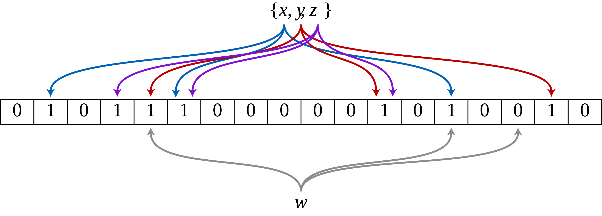

# Bloom Filter(布隆过滤器)学习

​		当我们进行一些数据操作时，常常需要判断某些元素是否存在于某一集合中，实现这一操作的数据结构有哈希表、树、链表等，折三种结构的检索时间复杂度分别是O(1), O(logn), O(n)，随着集合元素的不断增加，需要越来越大的存储空间，因此检索速度也会越来越慢。1970年，布隆提出了一种数据结构，由一个很长的二进制向量和一系列哈希函数组成，它的空间效率和查询时间都远远超过一半的数据结构，这种数据结构被称为布隆过滤器。

​		**布隆过滤器的基本思想是当一个元素被加入集合时，通过K个散列函数将其映射到一个二进制数组上对应的K的位置，并将该位置置1，检索时只需判断对应的位置上的元素是否都为1即可判断该元素是否有可能出现在集合中，只要有一个是0即可认为该元素不在集合中。**注意了，这里说的是有可能出现在集合中，因为随着集合元素不断的增加，哈希函数可能会映射到同一位置，因此这也是布隆过滤器的缺点，即只能提供元素在集合中存在的概率，具有一定的误识别率和删除困难，误识别指的是布隆过滤器给出可能存在于集合中，但是实际上在集合中并没有出现，布隆过滤器给出false的话说明一定不在集合中。因此，Bloom Filter不适合于“零错误”的应用场合，但是在一些能够容忍低错误率的生产环境里，BF可以通过牺牲一些准确率换取运行速度的极大提高。

## Bloom Filter原理

​		先前已经提到，Bloom Filter是一种由位数组和哈希函数组成的数据结构，下面我们具体看一下BF是怎样用位数组来表示集合$S={x_1, x_2, ..., x_n}$的：

  * 初始状态时，Bloom Filter是一个size为m的位数组，每一位都置为0；

* 假设哈希函数个数为K且K个哈希函数相互独立，分别将集合中的每一个元素映射到位数组$1, ..., m$的K个位置上，对应的位置值置为1；如果一个位置被多个哈希函数置为1，那么只有第一次会起作用。如下图，m-18, K=3，且有哈希函数映射到同一位置。

  ​													

* 在判断$y$是否属于这个集合时，我们对$y$应用$k$次哈希函数，如果所有$h_i(y)$的位置都是$1$  $(1≤i≤k)$，那么我们就认为$y$是集合中的元素，否则就认为$y$不是集合中的元素。

  Bloom Filter的原理很简单，但是不难发现，BF在应用的过程中有三个关键的参数，期望数组的大小m，哈希函数的个数K，期望的错误率FP，参数的选择会影响BF的运行速度和误识别率。

  ### 错误率估计

  我们首先估计一下Bloom Filter的错误率大小，假设位数组的大小$m$大于$kn$，即$kn<m$，此时集合中的n个元素均经过完全随机的K个哈希函数映射后，位数组中某一位依然是0的概率$p_0$:
  $$
  p_0=(1-\frac{1}{m})^{kn} \approx e^{-kn/m}
  $$
  对应的，该位为1的概率$p_1$为：
  $$
  p_1=1-(1-\frac{1}{m})^{kn} \approx 1-e^{-kn/m}
  $$
  当检测某一元素是否在集合中时，需要对该元素按照K个哈希函数进行映射，映射结果全为1的概率为：
  $$
  {\displaystyle \varepsilon =\left(1-\left[1-{\frac {1}{m}}\right]^{kn}\right)^{k}\approx \left(1-e^{-kn/m}\right)^{k}.}
  $$
  但是该方法会产生误识别，即错误的将原本不在集合中的元素被认定为可能在集合中。这并不是严格正确的，因为它假设每个位的概率都是独立的。但是，假设它是一个非常近似的值，则误报的概率会随着m（数组中位数）的增加而降低，而随着n（插入元素的数量）的增加而增加。

  Mitzenmacher和Upfal给出了一种在不假设独立性的情况下达到相同近似值的替代分析，将所有n项都添加到Bloom过滤器后，令q为设置为0的m位的占比（即，仍设置为0的位数为qm。）当测试元素不在集合中，对于k个哈希函数中的任何一个给定的数组位置，发现该位设置为1的概率为${1-q}$。因此，所有k个散列函数都将其位设置为1的概率为${\displaystyle(1-q)^{k}}$，q的期望值是对于n个元素中的每一个经过k个哈希函数中都保持不变的概率
  $$
  E[q]=\left(1-{\frac {1}{m}}\right)^{kn}.
  $$
  在没有独立性假设的情况下，可以证明q非常集中在其期望值附近，有
  $$
  {\displaystyle \Pr(\left|q-E[q]\right|\geq {\frac {\lambda }{m}})\leq 2\exp(-2\lambda ^{2}/kn)}
  $$
  因此，我们可以认为误识别率false positives的概率为
  $$
  \sum _{t}\Pr(q=t)(1-t)^{k}\approx (1-E[q])^{k}=\left(1-\left[1-{\frac {1}{m}}\right]^{kn}\right)^{k}\approx \left(1-e^{-kn/m}\right)^{k}
  $$

  ### 最优哈希函数个数

  得到错误率估计后，我们对上式进行转换，得：
  $$
  f=e^{k\ln(1-e^{-kn/m})}
  $$
  要求令$f$最小的$k$值，可以对$f$求$log$，有：
  $$
  \ln f = {k\ln(1-e^{-kn/m})}=-\frac{m}{n}\ln(e^{-kn/m})\ln(1-e^{-kn/m})
  $$
  令$p=e^{-kn/m}$，可以将上式简化成：$\ln f=-\frac{m}{n}\ln{(p)}\ln{(1-p)}$，根据对称性法则可以看出当${\displaystyle k={\frac {m}{n}}\ln 2}$，p=1/2时，f取最小值。

  **综上，Bloom Filter 的一个优良特性就是可以修改过滤器的错误率。一个大的过滤器会拥有比一个小的过滤器更低的错误率。错误率会近似于 $(1-e^{-kn/m})^k$, 所以你只需要先确定可能插入的数据集的容量大小 *n*, 然后再调整 *k* 和 *m* 来为你的应用配置过滤器。**

  Bloom filter 使用的哈希函数越多运行速度就会越慢。但是如果哈希函数过少，又会遇到误判率高的问题。所以这个问题上需要认真考虑。在创建一个 Bloom filter 的时候需要确定 *k* 的值，也就是说你需要提前圈定 *n* 的变动范围。而一旦你这样做了，你依然需要确定 *m*（总比特数）和 *k* (哈希函数的个数）的值。似乎这是一个十分困难的优化问题，但幸运的是，对于给定的 *m* 和 *n* ，我们可以利用上式确定最优的 *k* 值。

  所以可以通过以下的步骤来确定 Bloom filter 的大小:

  1. 确定 *n* 的变动范围
  2. 选定 *m* 的值
  3. 计算 *k* 的最优值
  4. 对于给定的*n*, *m*, and *k*计算错误率。如果这个错误率不能接收，那么回到第二步，否则结束

  ### Bloom Filter的重要公式

  1. $$
     n=-\frac{m}{k}\ln(1-\frac{\ln f}{k})
     $$

     

  2. $$
     p=e^{k\ln(1-e^{-kn/m})}
     $$

     

  3. $$
     m=\frac{n*\ln p}{\ln2*\ln\frac{1}{2}}
     $$

     

  4. $$
     k=\frac{m}{n}ln2
     $$

     

