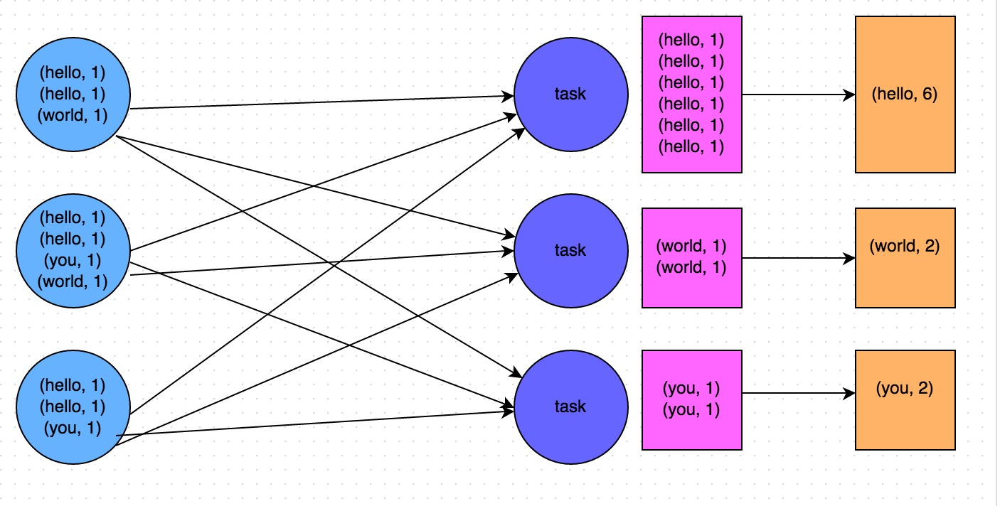
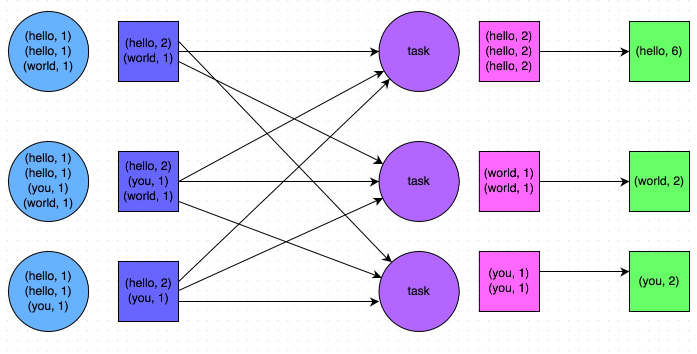
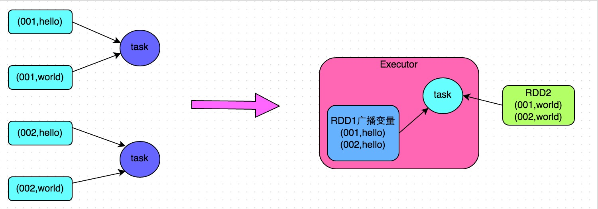

# spark性能优化

## **总体原则**：

### **原则一：避免创建重复的RDD**

### **原则二：尽可能复用同一个RDD**

### **原则三：对多次使用的RDD进行持久化**

```scala
// 如果要对一个RDD进行持久化，只要对这个RDD调用cache()和persist()即可。

// 正确的做法。
// cache()方法表示：使用非序列化的方式将RDD中的数据全部尝试持久化到内存中。
// 此时再对rdd1执行两次算子操作时，只有在第一次执行map算子时，才会将这个rdd1从源头处计算一次。
// 第二次执行reduce算子时，就会直接从内存中提取数据进行计算，不会重复计算一个rdd。
val rdd1 = sc.textFile("hdfs://192.168.0.1:9000/hello.txt").cache()
rdd1.map(...)
rdd1.reduce(...)

// persist()方法表示：手动选择持久化级别，并使用指定的方式进行持久化。
// 比如说，StorageLevel.MEMORY_AND_DISK_SER表示，内存充足时优先持久化到内存中，内存不充足时持久化到磁盘文件中。
// 而且其中的_SER后缀表示，使用序列化的方式来保存RDD数据，此时RDD中的每个partition都会序列化成一个大的字节数组，然后再持久化到内存或磁盘中。
// 序列化的方式可以减少持久化的数据对内存/磁盘的占用量，进而避免内存被持久化数据占用过多，从而发生频繁GC。
val rdd1 = sc.textFile("hdfs://192.168.0.1:9000/hello.txt").persist(StorageLevel.MEMORY_AND_DISK_SER)
rdd1.map(...)
rdd1.reduce(...)
```

* **Spark的持久化级别**

| 持久化级别                              | 含义解释                                                     |
| :-------------------------------------- | :----------------------------------------------------------- |
| MEMORY_ONLY                             | 使用未序列化的Java对象格式，将数据保存在内存中。如果内存不够存放所有的数据，则数据可能就不会进行持久化。那么下次对这个RDD执行算子操作时，那些没有被持久化的数据，需要从源头处重新计算一遍。这是默认的持久化策略，使用cache()方法时，实际就是使用的这种持久化策略。 |
| MEMORY_AND_DISK                         | 使用未序列化的Java对象格式，优先尝试将数据保存在内存中。如果内存不够存放所有的数据，会将数据写入磁盘文件中，下次对这个RDD执行算子时，持久化在磁盘文件中的数据会被读取出来使用。 |
| MEMORY_ONLY_SER                         | 基本含义同MEMORY_ONLY。唯一的区别是，会将RDD中的数据进行序列化，RDD的每个partition会被序列化成一个字节数组。这种方式更加节省内存，从而可以避免持久化的数据占用过多内存导致频繁GC。 |
| MEMORY_AND_DISK_SER                     | 基本含义同MEMORY_AND_DISK。唯一的区别是，会将RDD中的数据进行序列化，RDD的每个partition会被序列化成一个字节数组。这种方式更加节省内存，从而可以避免持久化的数据占用过多内存导致频繁GC。 |
| DISK_ONLY                               | 使用未序列化的Java对象格式，将数据全部写入磁盘文件中。       |
| MEMORY_ONLY_2, MEMORY_AND_DISK_2, 等等. | 对于上述任意一种持久化策略，如果加上后缀_2，代表的是将每个持久化的数据，都复制一份副本，并将副本保存到其他节点上。这种基于副本的持久化机制主要用于进行容错。假如某个节点挂掉，节点的内存或磁盘中的持久化数据丢失了，那么后续对RDD计算时还可以使用该数据在其他节点上的副本。如果没有副本的话，就只能将这些数据从源头处重新计算一遍了。 |

### **原则四：尽量避免使用shuffle类算子**

Broadcast与map进行join代码示例

```scala
// 传统的join操作会导致shuffle操作。
// 因为两个RDD中，相同的key都需要通过网络拉取到一个节点上，由一个task进行join操作。
val rdd3 = rdd1.join(rdd2)

// Broadcast+map的join操作，不会导致shuffle操作。
// 使用Broadcast将一个数据量较小的RDD作为广播变量。
val rdd2Data = rdd2.collect()
val rdd2DataBroadcast = sc.broadcast(rdd2Data)

// 在rdd1.map算子中，可以从rdd2DataBroadcast中，获取rdd2的所有数据。
// 然后进行遍历，如果发现rdd2中某条数据的key与rdd1的当前数据的key是相同的，那么就判定可以进行join。
// 此时就可以根据自己需要的方式，将rdd1当前数据与rdd2中可以连接的数据，拼接在一起（String或Tuple）。
val rdd3 = rdd1.map(rdd2DataBroadcast...)

// 注意，以上操作，建议仅仅在rdd2的数据量比较少（比如几百M，或者一两G）的情况下使用。
// 因为每个Executor的内存中，都会驻留一份rdd2的全量数据。
```

### **原则五：使用map-side预聚合的shuffle操作**

所谓的map-side预聚合，说的是在每个节点本地对相同的key进行一次聚合操作，类似于MapReduce中的本地combiner。map-side预聚合之后，每个节点本地就只会有一条相同的key，因为多条相同的key都被聚合起来了。其他节点在拉取所有节点上的相同key时，就会大大减少需要拉取的数据数量，从而也就减少了磁盘IO以及网络传输开销。通常来说，在可能的情况下，建议使用reduceByKey或者aggregateByKey算子来替代掉groupByKey算子。因为reduceByKey和aggregateByKey算子都会使用用户自定义的函数对每个节点本地的相同key进行预聚合。而groupByKey算子是不会进行预聚合的，全量的数据会在集群的各个节点之间分发和传输，性能相对来说比较差。





### **原则六：使用高性能的算子**

1. 使用reduceByKey/aggregateByKey替代groupByKey
2. 使用mapPartitions替代普通map
3. 使用foreachPartitions替代foreach
4. 使用filter之后进行coalesce操作
5. 使用repartitionAndSortWithinPartitions替代repartition与sort类操作

### **原则七：广播大变量**

有时在开发过程中，会遇到需要在算子函数中使用外部变量的场景（尤其是大变量，比如100M以上的大集合），那么此时就应该使用Spark的广播（Broadcast）功能来提升性能。

在算子函数中使用到外部变量时，默认情况下，Spark会将该变量复制多个副本，通过网络传输到task中，此时每个task都有一个变量副本。如果变量本身比较大的话（比如100M，甚至1G），那么大量的变量副本在网络中传输的性能开销，以及在各个节点的Executor中占用过多内存导致的频繁GC，都会极大地影响性能。

因此对于上述情况，如果使用的外部变量比较大，建议使用Spark的广播功能，对该变量进行广播。广播后的变量，会保证每个Executor的内存中，只驻留一份变量副本，而Executor中的task执行时共享该Executor中的那份变量副本。这样的话，可以大大减少变量副本的数量，从而减少网络传输的性能开销，并减少对Executor内存的占用开销，降低GC的频率。

广播大变量的代码示例

```scala
// 以下代码在算子函数中，使用了外部的变量。
// 此时没有做任何特殊操作，每个task都会有一份list1的副本。
val list1 = ...
rdd1.map(list1...)

// 以下代码将list1封装成了Broadcast类型的广播变量。
// 在算子函数中，使用广播变量时，首先会判断当前task所在Executor内存中，是否有变量副本。
// 如果有则直接使用；如果没有则从Driver或者其他Executor节点上远程拉取一份放到本地Executor内存中。
// 每个Executor内存中，就只会驻留一份广播变量副本。
val list1 = ...
val list1Broadcast = sc.broadcast(list1)
rdd1.map(list1Broadcast...)
```

### **原则八：使用Kryo优化序列化性能**

在Spark中，主要有三个地方涉及到了序列化： 

*  在算子函数中使用到外部变量时，该变量会被序列化后进行网络传输（见“原则七：广播大变量”中的讲解）。 
*  将自定义的类型作为RDD的泛型类型时（比如JavaRDD，Student是自定义类型），所有自定义类型对象，都会进行序列化。因此这种情况下，也要求自定义的类必须实现Serializable接口。 
*  使用可序列化的持久化策略时（比如MEMORY_ONLY_SER），Spark会将RDD中的每个partition都序列化成一个大的字节数组。

对于这三种出现序列化的地方，我们都可以通过使用Kryo序列化类库，来优化序列化和反序列化的性能。Spark默认使用的是Java的序列化机制，也就是ObjectOutputStream/ObjectInputStream API来进行序列化和反序列化。但是Spark同时支持使用Kryo序列化库，Kryo序列化类库的性能比Java序列化类库的性能要高很多。官方介绍，Kryo序列化机制比Java序列化机制，性能高10倍左右。Spark之所以默认没有使用Kryo作为序列化类库，是因为Kryo要求最好要注册所有需要进行序列化的自定义类型，因此对于开发者来说，这种方式比较麻烦。

以下是使用Kryo的代码示例，我们只要设置序列化类，再注册要序列化的自定义类型即可（比如算子函数中使用到的外部变量类型、作为RDD泛型类型的自定义类型等）：

```scala
// 创建SparkConf对象。
val conf = new SparkConf().setMaster(...).setAppName(...)
// 设置序列化器为KryoSerializer。
conf.set("spark.serializer", "org.apache.spark.serializer.KryoSerializer")
// 注册要序列化的自定义类型。
conf.registerKryoClasses(Array(classOf[MyClass1], classOf[MyClass2]))
```

[Spark性能优化指南——基础篇](https://tech.meituan.com/2016/04/29/spark-tuning-basic.html)

[Spark性能优化指南——高级篇- 美团技术团队](https://tech.meituan.com/2016/05/12/spark-tuning-pro.html)

## shuffle操作

### 1. countByKey 统计key的分布，判断数据倾斜的大致情况

### 2. map代替join操作

当大表和小表join时，可以考虑用map join来减少shuffle操作

==方案实现思路==：不使用join算子进行连接操作，而使用Broadcast变量与map类算子实现join操作，进而完全规避掉shuffle类的操作，彻底避免数据倾斜的发生和出现。将较小RDD中的数据直接通过collect算子拉取到Driver端的内存中来，然后对其创建一个Broadcast变量；接着对另外一个RDD执行map类算子，在算子函数内，从Broadcast变量中获取较小RDD的全量数据，与当前RDD的每一条数据按照连接key进行比对，如果连接key相同的话，那么就将两个RDD的数据用你需要的方式连接起来。

**==方案实现原理==：**普通的join是会走shuffle过程的，而一旦shuffle，就相当于会将相同key的数据拉取到一个shuffle read task中再进行join，此时就是reduce join。但是如果一个RDD是比较小的，则可以采用广播小RDD全量数据+map算子来实现与join同样的效果，也就是map join，此时就不会发生shuffle操作，也就不会发生数据倾斜。具体原理如下图所示。

**==方案优点==：**对join操作导致的数据倾斜，效果非常好，因为根本就不会发生shuffle，也就根本不会发生数据倾斜。

**==方案缺点==：**适用场景较少，因为这个方案只适用于一个大表和一个小表的情况。毕竟我们需要将小表进行广播，此时会比较消耗内存资源，driver和每个Executor内存中都会驻留一份小RDD的全量数据。如果我们广播出去的RDD数据比较大，比如10G以上，那么就可能发生内存溢出了。因此并不适合两个都是大表的情况。



```java
// 首先将数据量比较小的RDD的数据，collect到Driver中来。
List<Tuple2<Long, Row>> rdd1Data = rdd1.collect()
// 然后使用Spark的广播功能，将小RDD的数据转换成广播变量，这样每个Executor就只有一份RDD的数据。
// 可以尽可能节省内存空间，并且减少网络传输性能开销。
final Broadcast<List<Tuple2<Long, Row>>> rdd1DataBroadcast = sc.broadcast(rdd1Data);
  
// 对另外一个RDD执行map类操作，而不再是join类操作。
JavaPairRDD<String, Tuple2<String, Row>> joinedRdd = rdd2.mapToPair(
        new PairFunction<Tuple2<Long,String>, String, Tuple2<String, Row>>() {
            private static final long serialVersionUID = 1L;
            @Override
            public Tuple2<String, Tuple2<String, Row>> call(Tuple2<Long, String> tuple)
                    throws Exception {
                // 在算子函数中，通过广播变量，获取到本地Executor中的rdd1数据。
                List<Tuple2<Long, Row>> rdd1Data = rdd1DataBroadcast.value();
                // 可以将rdd1的数据转换为一个Map，便于后面进行join操作。
                Map<Long, Row> rdd1DataMap = new HashMap<Long, Row>();
                for(Tuple2<Long, Row> data : rdd1Data) {
                    rdd1DataMap.put(data._1, data._2);
                }
                // 获取当前RDD数据的key以及value。
                String key = tuple._1;
                String value = tuple._2;
                // 从rdd1数据Map中，根据key获取到可以join到的数据。
                Row rdd1Value = rdd1DataMap.get(key);
                return new Tuple2<String, String>(key, new Tuple2<String, Row>(value, rdd1Value));
            }
        });
  
// 这里得提示一下。
// 上面的做法，仅仅适用于rdd1中的key没有重复，全部是唯一的场景。
// 如果rdd1中有多个相同的key，那么就得用flatMap类的操作，在进行join的时候不能用map，而是得遍历rdd1所有数据进行join。
// rdd2中每条数据都可能会返回多条join后的数据。
```


## checkpoint

## cache

